 
# PaCE@NTU SCTP Cohort 2 - Cloud Infrastructure Engineering

## Monitoring Large Applications (Site Reliability Engineering)

**Group 3**: Soo Wei Heng | Ren Peng | Sangeetha Thirumurugan | Ng Yu Yuan | Selvam S/O P Mohan

---

## TechWise Innovations Company Profile

At TechWise Innovations, we are pioneers in the field of enterprise software solutions, with a special focus on microservices architecture. We take pride in our team of Site Reliability Engineers (SREs) who play a critical role in ensuring early detection, enhancing observability, and guaranteeing system reliability.

---

## Monitoring and Visualization

When it comes to visualizing metrics from every component of your system, the dynamic duo of Grafana and Prometheus reign supreme:

- **Grafana**: The visualization powerhouse that transforms Prometheus data into actionable insights.
- **Prometheus**: Your go-to monitoring solution for storing critical time series data, including vital metrics.

Together, they empower you to harness the full potential of your data, ensuring that you never miss a beat in your monitoring and visualization endeavors.

---

## Solution Architecture


---

## Movie App Project

The application team recently worked with an entertainment company specializing in streaming online media content to create a movie application. The movie app project used React components, router redirects, Firebase backend, and data pulled from an API with Axios.

- [GitHub Repository](https://github.com/Sule-Ss/movie-app-with-react)
- [Requirements Gathering](https://docs.google.com/spreadsheets/d/11J3PLi_lxMLwQo3EYkwIn_NQOdFA3hFcKvUAmc0bSTU/edit#gid=0)
- [Jira Board](https://sctp-cloud-cohort2-group3.atlassian.net/jira/software/projects/GCP/boards/1)

The application was containerized using Docker and deployed to AWS Elastic Container Service.

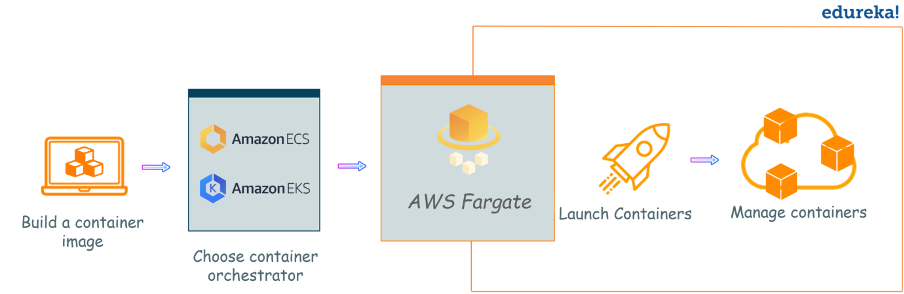
### Cloning the Repository to Your Local Environment

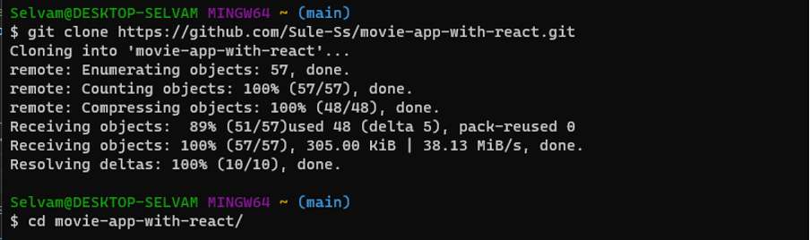
```shell
git clone https://github.com/Sule-Ss/movie-app-with-react.git
cd movie-app-with-react
code .
```

### Create Dockerfile
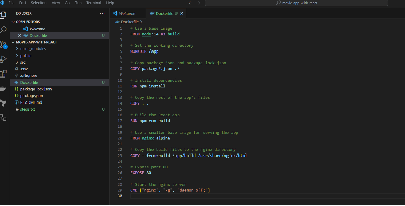
```Dockerfile
# Use a base image
FROM node:14 as build

# Set the working directory
WORKDIR /app

# Copy package.json and package-lock.json
COPY package*.json ./

# Install dependencies
RUN npm install

# Copy the rest of the app’s files
COPY . .

# Build the React app
RUN npm run build

# Use a smaller base image for serving the app
FROM nginx:alpine

# Copy the build files to the nginx directory
COPY --from=build /app/build /usr/share/nginx/html

# Expose port 80
EXPOSE 80

# Start the nginx server
CMD ["nginx", "-g", "daemon off;"]
```

## Docker Commands
1. Open Docker Desktop and sign in.

2. Go back to your VS Code.

3. Build the Docker image with a tag (name) for the image:
```
docker build -t movie-app-image .
```
(The -t flag is used to tag or name the Docker image that is being built.)

4. Run the Docker container, mapping port 8080 on the host to port 80 in the container, and run it in detached mode:
```
docker run -p 8080:80 -d movie-app-image
```
(The -p flag is used to map or publish ports between the host and the container. For example, port 80 within the container will be mapped to port 8080 on the host machine. The -d flag is used to run a container in detached mode, which means the container runs in the background as a daemon process.)

5. Once you can deploy locally, you can proceed to deploy it on Amazon Elastic Container Service (ECS).

6. Build the Docker image again with the same tag (if needed) to ensure you have the latest image locally:
```
docker build -t movie-app-image .
```
7. The Docker image will be pushed to Amazon Elastic Container Registry (ECR). Ensure you are signed in to your AWS account via a web browser.

8. Obtain an ECR login password for the specified AWS region and log in to ECR using Docker:
```
aws ecr get-login-password --region ap-southeast-1 | docker login --username AWS --password-stdin 255945442255.dkr.ecr.ap-southeast-1.amazonaws.com
```

## Create a Repository in Amazon Elastic Container Registry (ECR)
1. Next, you need to create a repository in Amazon Elastic Container Registry (ECR) where you can store your Docker image.
2. 
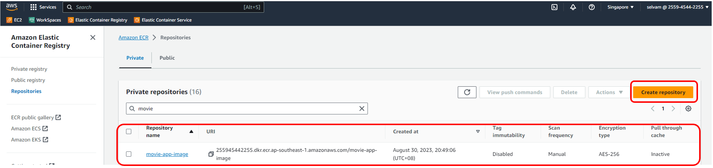

3. Enter a unique name for your repository in the ECR console.

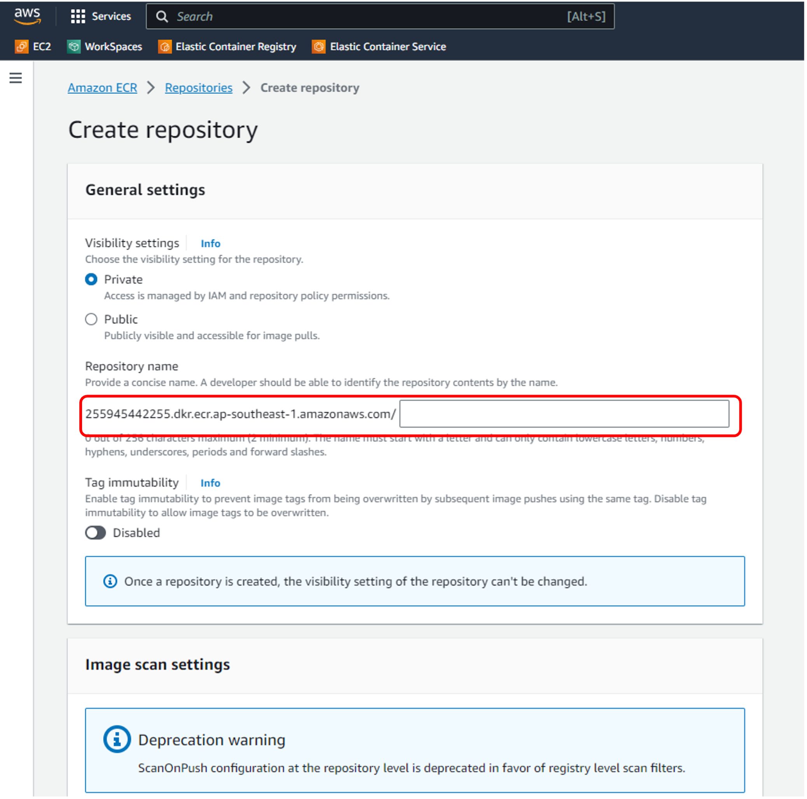

## Tag Docker Image with Amazon Elastic Container Registry
After creating the repository, you'll need to tag your Docker image with the ECR repository URL and a specific tag (e.g., "latest"). This is necessary for pushing the image to ECR.
```
docker tag movie-app-image:latest 255945442255.dkr.ecr.ap-southeast-1.amazonaws.com/movie-app-image:latest
```
(Replace "movie-app-image" with your image name and "latest" with your desired tag if different.)

## Push Image to Amazon Elastic Container Registry (ECR)
Now that your Docker image is tagged correctly, you can push it to Amazon Elastic Container Registry (ECR) using the following command:
```
docker push 255945442255.dkr.ecr.ap-southeast-1.amazonaws.com/movie-app-image:latest
```

## Terraform Configuration for Amazon Elastic Container Service (ECS)
The deployment of your container to Amazon Elastic Container Service (ECS) will be orchestrated using Terraform. You will need to create a Terraform configuration file in your Visual Studio Code (VS Code) environment. Below is the Terraform code for configuring your ECS setup:

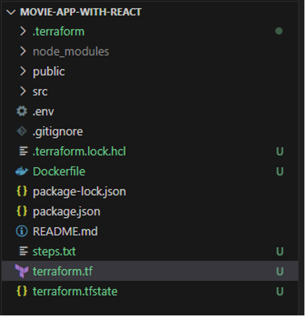

```Terraform.tf
provider "aws" {
  region = "ap-southeast-1" # Modify this with your desired AWS region
}

locals {
  application_name = "movie-app-image" # Replace with your application name
}

resource "aws_ecs_task_definition" "my_task_definition" {
  family                   = local.application_name
  network_mode             = "awsvpc"
  requires_compatibilities = ["FARGATE"]
  execution_role_arn      = "arn:aws:iam::255945442255:role/ecsTaskExecutionRole" # Replace with your execution role ARN

  container_definitions = jsonencode([
    {
      name  = local.application_name
      image = "255945442255.dkr.ecr.ap-southeast-1.amazonaws.com/movie-app-image:latest" # Modify with your ECR image URL
      portMappings = [
        {
          containerPort = 8080
          hostPort      = 8080
          protocol      = "tcp"
        }
      ]
      essential = true
    }
  ])

  cpu    = "512"
  memory = "1024"
}

resource "aws_ecs_cluster" "my_ecs_cluster" {
  name = "${local.application_name}-cluster"
}

resource "aws_ecs_service" "my_ecs_service" {
  name            = "${local.application_name}-service"
  cluster         = aws_ecs_cluster.my_ecs_cluster.id
  task_definition = aws_ecs_task_definition.my_task_definition.arn
  launch_type     = "FARGATE"

  network_configuration {
    subnets          = ["subnet-04056e91a09a5b4bf", "subnet-bea677f6", "subnet-29ed7170"] # Modify with your subnet IDs
    assign_public_ip = true
    security_groups = ["sg-b4db57fc"] # Modify with your security group IDs
  }

  scheduling_strategy = "REPLICA"
  desired_count       = 1
  platform_version    = "LATEST"
  deployment_controller {
    type = "ECS"
  }
  deployment_maximum_percent = 200
  deployment_minimum_healthy_percent = 100
  enable_ecs_managed_tags = true
}
```

Commands used:
- terraform init
- terraform plan
- terraform apply

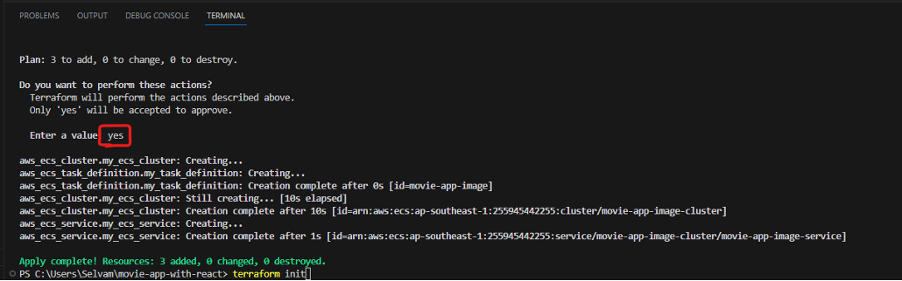

# GitHub Actions for Automation

The deployment of your application using Terraform scripts will be automated via GitHub Actions.

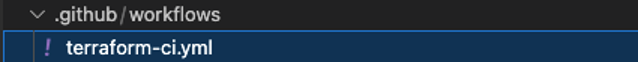

## Setting Up GitHub Actions Workflow

Inside your repository, create a `.github/workflows` directory and add a YAML file for your workflow. Name it something like `deploy-movie-app.yml`.

```yaml
name: Deploy Movie App
run-name: ${{ github.actor }} is doing CICD to deploy AWS ECS

on:
push:
 branches:
   - main

jobs:
deploy:
 name: Deploy Movie App
 runs-on: ubuntu-latest

 steps:
   - name: Checkout
     uses: actions/checkout@v3

   - name: Configure AWS credentials
     uses: aws-actions/configure-aws-credentials@v1
     with:
       aws-access-key-id: ${{secrets.AWS_ACCESS_KEY_ID}}
       aws-secret-access-key: ${{secrets.AWS_SECRET_ACCESS_KEY}}
       aws-region: ap-southeast-1

   - name: Login to Amazon ECR
     id: login-ecr
     uses: aws-actions/amazon-ecr-login@v1

   - name: Build, tag, and push image to Amazon ECR
     id: build-image
     env:
       ECR_REGISTRY: ${{ steps.login-ecr.outputs.registry }}
       ECR_REPOSITORY: movie-app-weiheng-test
       IMAGE_TAG: latest
     run: |
       # Build a Docker container and
       # push it to ECR so that it can
       # be deployed to ECS.
       docker build -t $ECR_REGISTRY/$ECR_REPOSITORY:$IMAGE_TAG .
       docker push $ECR_REGISTRY/$ECR_REPOSITORY:$IMAGE_TAG
       echo "::set-output name=image::$ECR_REGISTRY/$ECR_REPOSITORY:$IMAGE_TAG"

   - name: Initialize Terraform
     run: terraform init
     working-directory: .

   - name: Plan Terraform changes
     run: terraform plan
     working-directory: .

   - name: Apply Terraform changes
     run: terraform apply -auto-approve
     working-directory: .
```

Create secrets in your GitHub repository to store sensitive data like AWS access keys. Name them AWS_ACCESS_KEY_ID and AWS_SECRET_ACCESS_KEY.
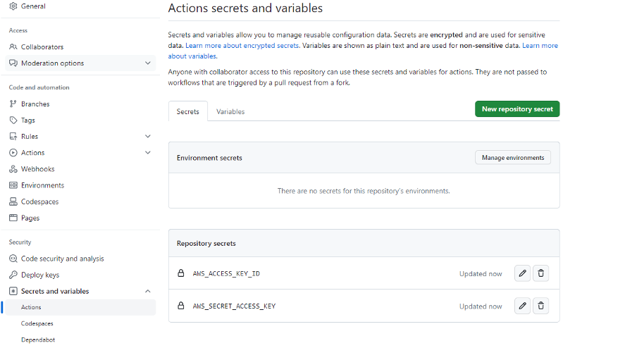

## Running the GitHub Actions Workflow
To trigger the GitHub Actions workflow, use the following commands:

```
git add .
git commit -m 'Initial commit'
git push
```
Inside GitHub Actions, you can monitor the workflow's progress, debug any errors, and ensure that all steps are executed successfully.
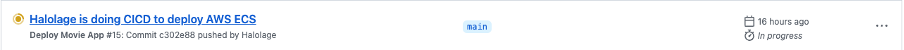


## Verifying the Deployment on AWS ECS

1. Open the AWS Management Console and navigate to **Elastic Container Service (ECS)**.

2. In the ECS dashboard, find and click on the `movie-app-image-cluster`. This will take you to the cluster details page.
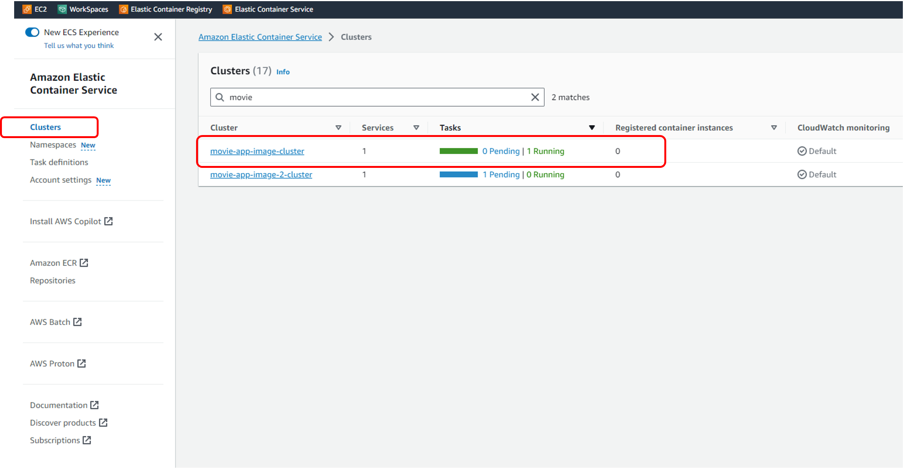
3. On the cluster details page, locate and click on the service name, which should be `movie-app-image-service`.
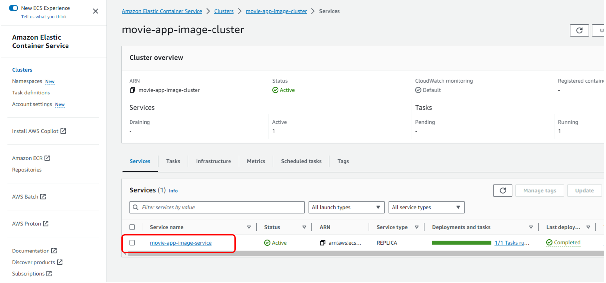
4. Next, click on the **Tasks** tab to view the list of tasks.
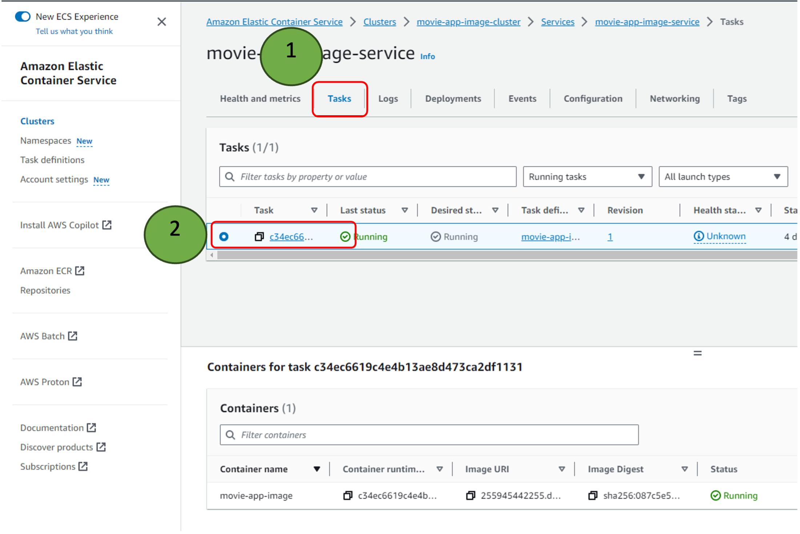
5. Locate the specific task related to your deployment and click on it.

6. In the task details, go to the **Network Bindings** tab to access the external link.
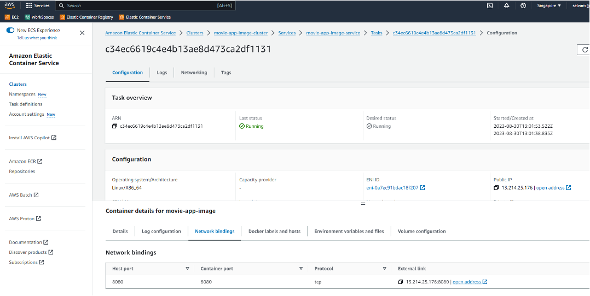
7. The movie application will be accessible through the external link. You can access it by clicking on the provided link, which should look something like: [http://13.214.25.176:80](http://13.214.25.176:80).


## Cloudwatch logging:

Go into Cloudwatch service, we can see some startup logs have been generated:
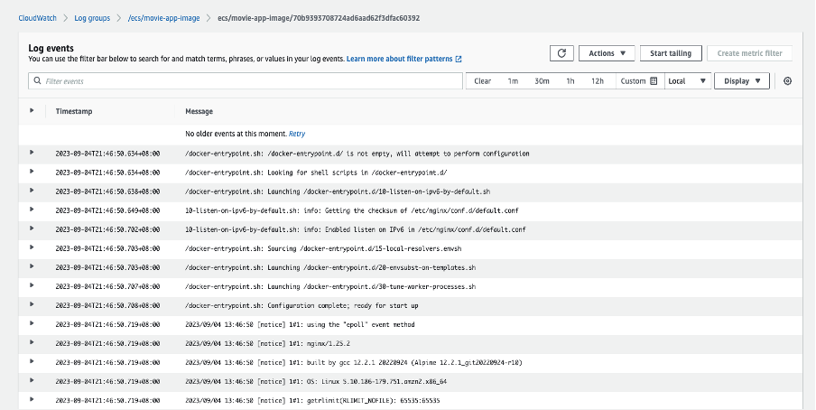

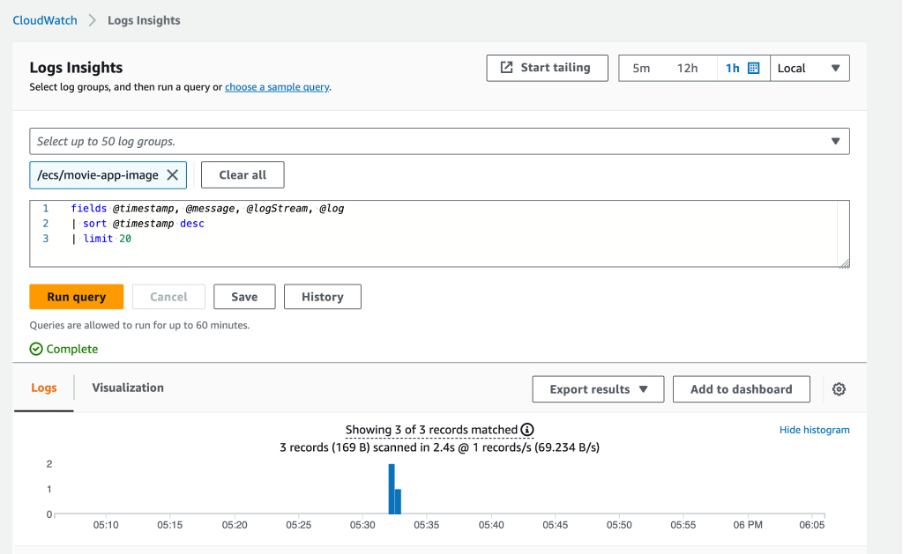


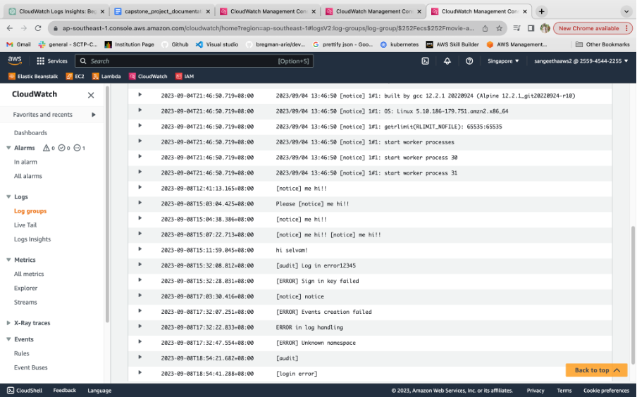

**To create 3 x EC2 instances**

> 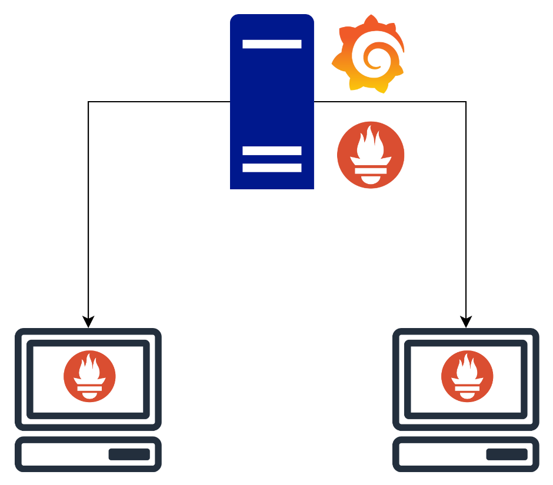
>
> **[Grafana Installation]**
>
> The latest version can be downloaded from:
> [[https://grafana.com/grafana/download?pg=get&plcmt=selfmanaged-box1-cta1]](https://grafana.com/grafana/download?pg=get&plcmt=selfmanaged-box1-cta1)
>
> Commands to download and install Grafana

1)  Update your packages

sudo yum update -y

2)  To add a repository for Grafana so that our operating system will
    > know where it is

sudo vi /etc/yum.repos.d/Grafana.repo

3)  Proceed to add the below text to the repo file. This will install
    > the open-source Grafana.

\[grafana\]\
name=grafana\
baseurl=https://packages.grafana.com/oss/rpm\
repo_gpgcheck=1\
enabled=1\
gpgcheck=1\
gpgkey=https://packages.grafana.com/gpg.key\
sslverify=1\
sslcacert=/etc/pki/tls/certs/ca-bundle.crt

4)  Install Grafana

sudo yum install Grafana -y

5)  Reload the system

sudo systemctl daemon-reload

6)  Restart the server and check the service with the following commands

sudo systemctl start grafana-server

sudo systemctl status grafana-server

7)  Run the following command so that Grafana will start up
    > automatically if we stop and restart the instance.

sudo systemctl enable Grafana-server.service

Navigate to the EC2 instance to check the public IP
address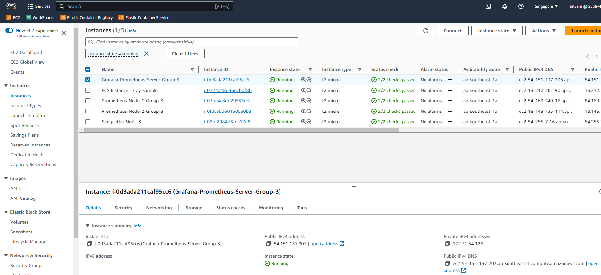

The default port for Grafana is 3000. Ensure port 3000 is in the inbound
rules

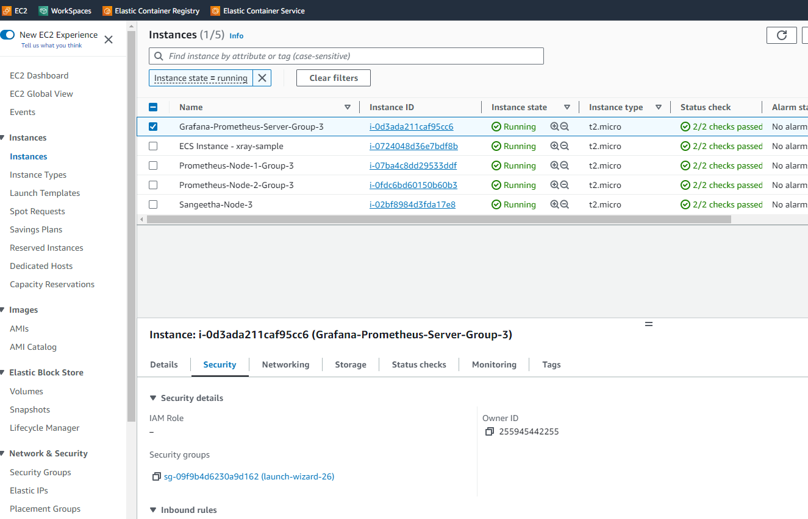

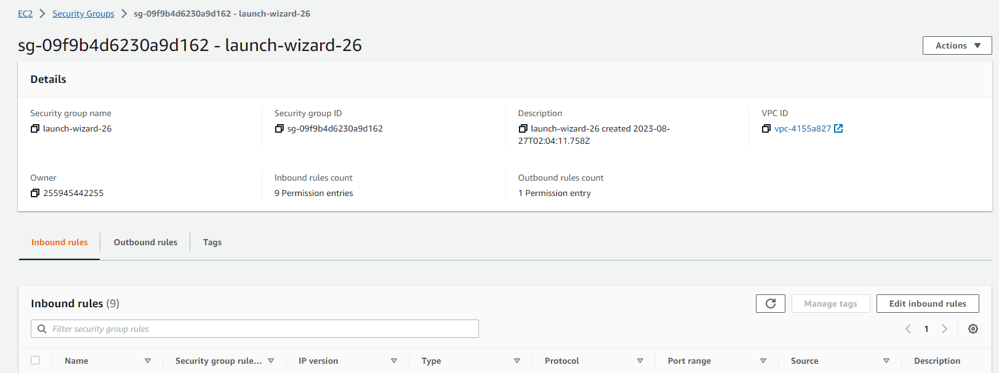

Select Custom TCP \> Port 3000 \> 0.0.0.0/0

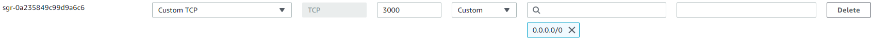

Access the public IP with the port

[[http://54.151.137.203:3000]](http://54.151.137.203:3000)

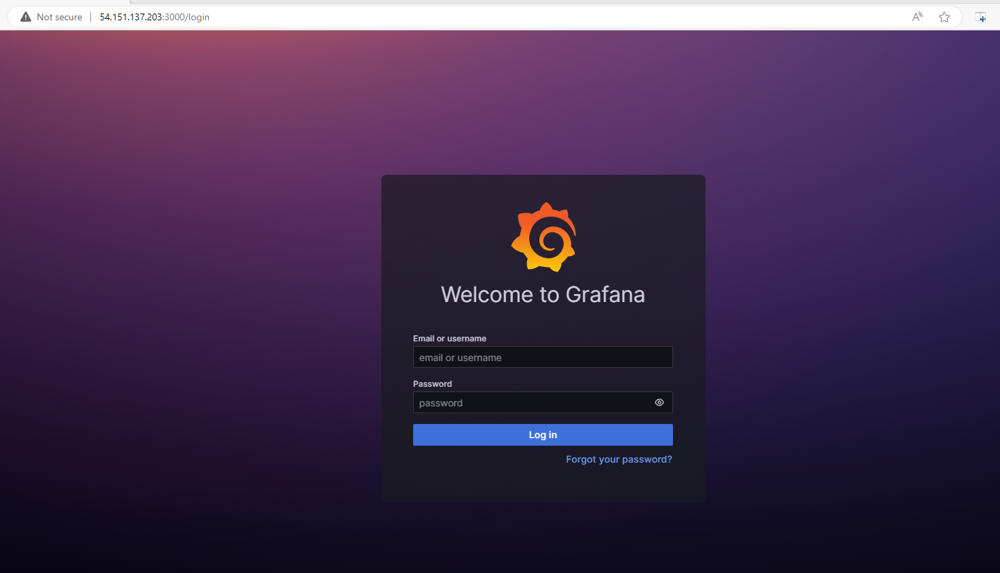

Enter the default credentials if you are just setting it up. Otherwise,
please check the credentials in your centralized password management
tool.

[[https://drive.google.com/file/d/1CArzX-nIfd7aJtKNEK4V2e_XYq3DsepS/view?usp=drive_link]](https://drive.google.com/file/d/1CArzX-nIfd7aJtKNEK4V2e_XYq3DsepS/view?usp=drive_link)

**[Prometheus Installation]**

Prometheus is an open-source tool for monitoring and alerting
applications.

1)  You can go to Prometheus Download page to copy the link

> [[https://github.com/prometheus/prometheus/releases/download/v2.47.0/prometheus-2.47.0.linux-amd64.tar.gz]](https://github.com/prometheus/prometheus/releases/download/v2.47.0/prometheus-2.47.0.linux-amd64.tar.gz)

Wget
[[https://github.com/prometheus/prometheus/releases/download/v2.47.0/prometheus-2.47.0.linux-amd64.tar.gz]](https://github.com/prometheus/prometheus/releases/download/v2.47.0/prometheus-2.47.0.linux-amd64.tar.gz)

2)  Untar Prometheus-2.47.0.linux-amd64.tar.gz

tar xvfz prometheus-2.47.0.linux-amd64.tar.gz

3)  CD into the extract directory

cd prometheus-2.47.0.linux-amd64

4)  Start the Prometheus server

./prometheus

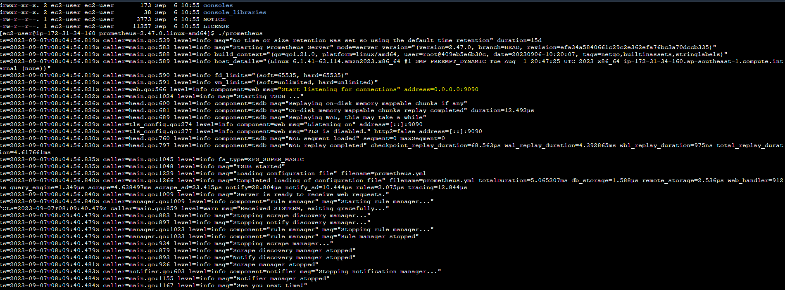
Do note that you need to add port 9090 from inbound rules

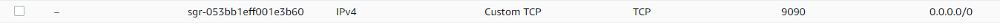

5)  Create the following file /etc/system/system/Prometheus.service so
    > that if the server restarts, the service will be up and running
    > automatically.

\[Unit\]

Description=Prometheus

Wants=network-online.target

After=network-online.target

\[Service\]

User=prometheus

Group=prometheus

Type=simple

ExecStart=/usr/local/bin/prometheus \\

\--config.file /etc/prometheus/prometheus.yml \\

\--storage.tsdb.path /var/lib/prometheus/ \\

\--web.console.templates=/etc/prometheus/consoles \\

\--web.console.libraries=/etc/prometheus/console_libraries

\[Install\]

WantedBy=multi-user.target

6)  Change ownership of all folders and files which we created to the
    > user which we have created.

sudo chown prometheus:prometheus /etc/prometheus\
sudo chown prometheus:prometheus /usr/local/bin/prometheus\
sudo chown prometheus:prometheus /usr/local/bin/promtool\
sudo chown -R prometheus:prometheus /etc/prometheus/consoles\
sudo chown -R prometheus:prometheus /etc/prometheus/console_libraries\
sudo chown -R prometheus:prometheus /var/lib/prometheus

7)  Configure the service and start it

sudo systemctl daemon-reload\
sudo systemctl enable prometheus\
sudo systemctl start prometheus\
sudo systemctl status prometheus

Access Prometheus:
[[http://54.151.137.203:9090]](http://54.151.137.203:9090)

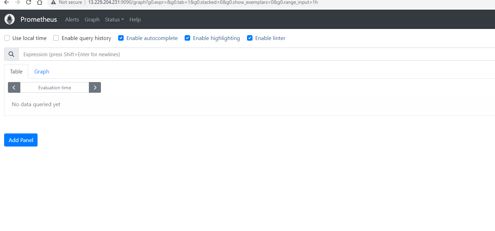

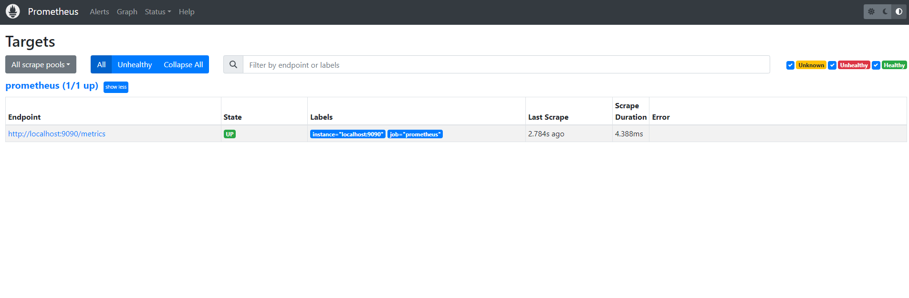

[[https://drive.google.com/file/d/19zGdgTebGTjw4K0aNnlg5UteO_qRA_Dr/view?usp=sharing]](https://drive.google.com/file/d/19zGdgTebGTjw4K0aNnlg5UteO_qRA_Dr/view?usp=sharing)

8)  Proceed to modify the Prometheus.yml file so monitor specify the
    > targets

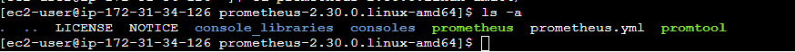

global:

scrape_interval: 15s

scrape_timeout: 10s

evaluation_interval: 1m

external_labels:

monitor: prometheus

scrape_configs:

\- job_name: prometheus

honor_timestamps: true

scrape_interval: 15s

scrape_timeout: 10s

metrics_path: /metrics

scheme: http

follow_redirects: true

enable_http2: true

static_configs:

\- targets:

\- 54.169.249.16:9100

\- 18.143.135.114:9100

9)  Once the targets are specified in the Prometheus.yml file, restart
    > the Prometheus service.

sudo service prometheus restart\
sudo service prometheus status

**[Installing Node Exporter]**

Node exporter is like a monitoring agent to be installed on all the
servers. (For windows servers, you need to install windows_exporter)

1)  Create new user and download node_exporter from Prometheus website

sudo useradd \--no-create-home node_exporter

wget
[[https://github.com/prometheus/node_exporter/releases/download/v1.6.1/node_exporter-1.6.1.linux-amd64.tar.gz]](https://github.com/prometheus/node_exporter/releases/download/v1.6.1/node_exporter-1.6.1.linux-amd64.tar.gz)

2)  Untar and copy node exporter to /usr/local/bin/node_exporter

tar xzf node_exporter-1.0.1.linux-amd64.tar.gz\
sudo cp node_exporter-1.0.1.linux-amd64/node_exporter
/usr/local/bin/node_exporter

3)  Remove the installer and folder

rm -rf node_exporter-1.0.1.linux-amd64.tar.gz
node_exporter-1.0.1.linux-amd64

4)  Copy the service file to /etc/system/system

sudo cp node-exporter.service /etc/systemd/system/node-exporter.service

5)  Enable and start the service

sudo systemctl daemon-reload\
sudo systemctl enable node-exporter\
sudo systemctl start node-exporter\
sudo systemctl status node-exporter

At this point, do add port 9100 from inbound rules

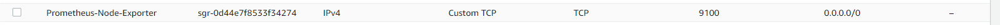

The two nodes will show up:

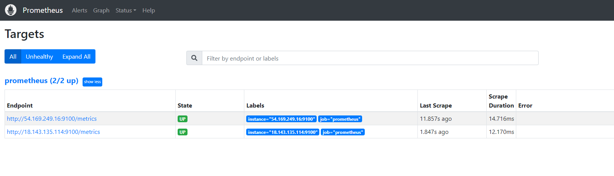

**[Grafana Dashboards]**

[[https://grafana.com/grafana/dashboards/]](https://grafana.com/grafana/dashboards/)

Install node exporter

Select dashboard id: 1860

[[https://grafana.com/grafana/dashboards/1860-node-exporter-full/]](https://grafana.com/grafana/dashboards/1860-node-exporter-full/)

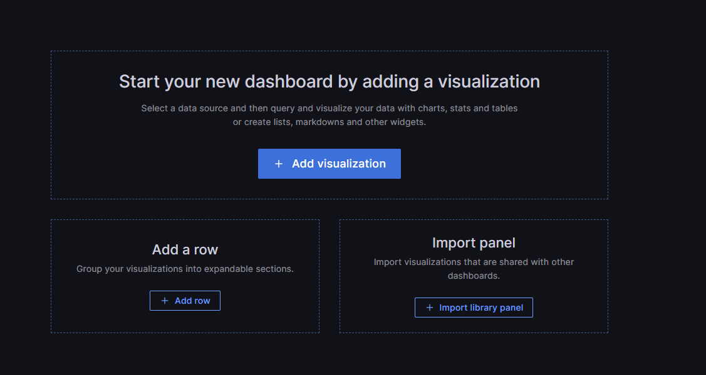

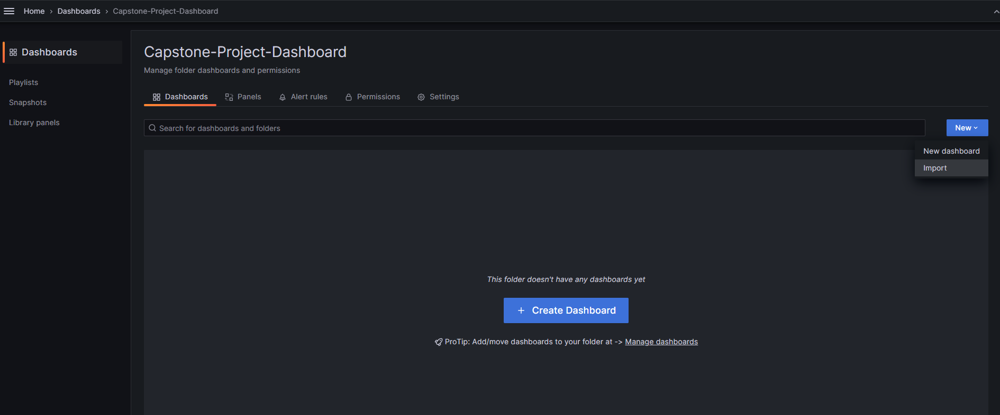


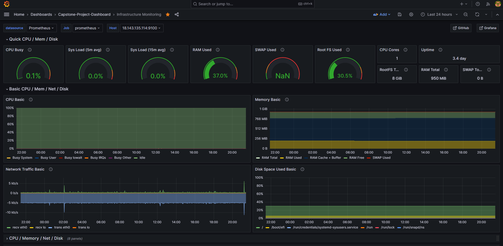

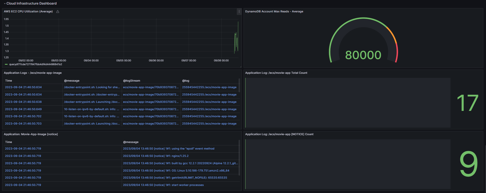

**Adding Datasource** -- For our example case, we are looking at
Prometheus. Use the same way to add CloudWatch Datasource

[[https://drive.google.com/file/d/138Wmgkf2Rl5IV9tjEUQXZQzS814vR6J8/view?usp=sharing]](https://drive.google.com/file/d/138Wmgkf2Rl5IV9tjEUQXZQzS814vR6J8/view?usp=sharing)

Filtering Cloudwatch Logs to display on dashboard:

[[https://drive.google.com/file/d/1P3HK2pEN1bR-AH1rKEThc9h3AoiEfyo0/view?usp=sharing]](https://drive.google.com/file/d/1P3HK2pEN1bR-AH1rKEThc9h3AoiEfyo0/view?usp=sharing)

**[Alert Rules Setup in Grafana Dashboard]**

To receive notifications in Grafana, you need to set up alerting rules
and configure notification channels. Grafana supports various
notification channels like email, Slack, PagerDuty, and more. Here\'s a
step-by-step guide on how to set up notifications in Grafana:

**[Prerequisites:]**

\- Ensure you have Grafana installed and configured.

\- Create a dashboard with the metrics you want to monitor.

**[Step 1: Configure Notification Channels]**

1\. Log in to your Grafana instance.

2\. Click on the three line icon
(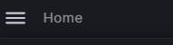) in the left sidebar to access the
\"Configuration\" menu.

3\. Under \"Alerting,\" click on \"Contact points.\"

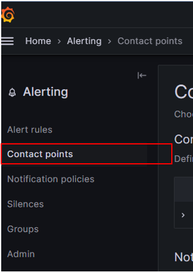

4\. Click the \"Add contact point\" button to create a new notification
channel.

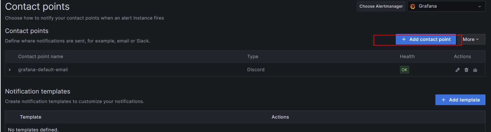

5\. Name the contact points Select the type of notification channel you
want to set up (e.g., Email, Slack, or others). Each channel type has
its own configuration options.

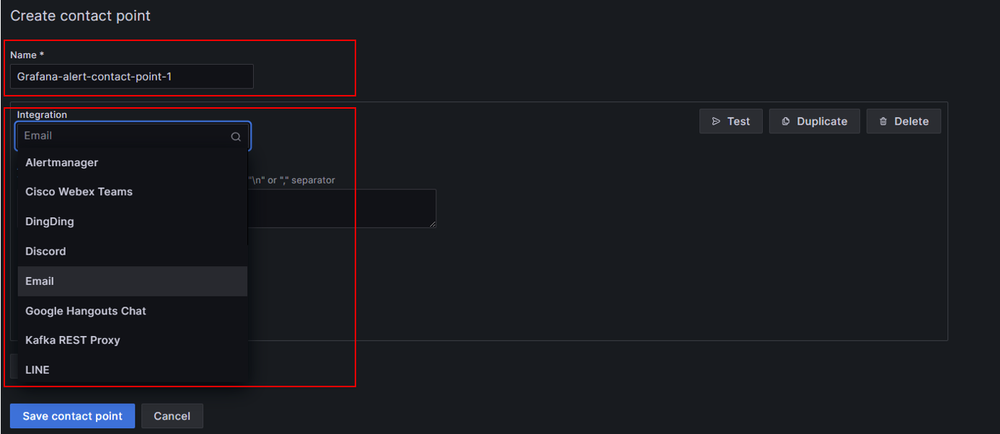

**In our project, we selected Discord.**

6\. Configure the notification channel according to the selected type.
For example, if you\'re setting up email notifications, you\'ll need to
provide the SMTP server details and email addresses. If you\'re setting
up Slack/ Discord notifications, you\'ll need to provide a Slack/Discord
webhook URL.

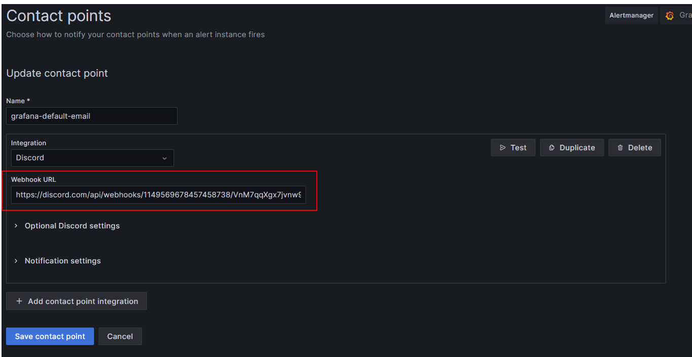

7\. Save the notification channel configuration by clicking " save
contact point"
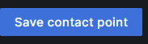 after click on the " test
"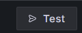 to verify the connection is ok. Following
shown the successful connection:

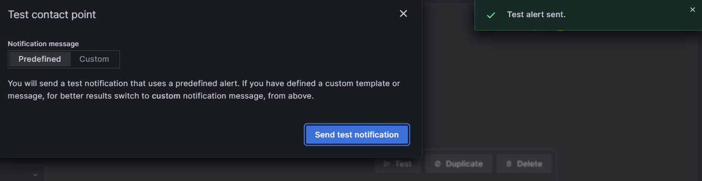

**[Step 2: Create Alerting Rules]**

1\. In Grafana, navigate to the dashboard where you want to set up
alerts.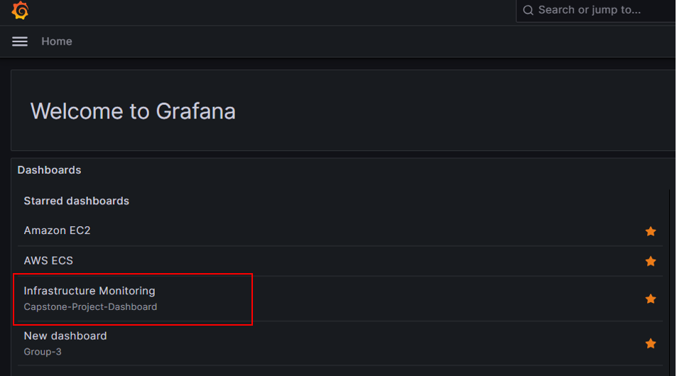

2\. Select which panel to set the rules.

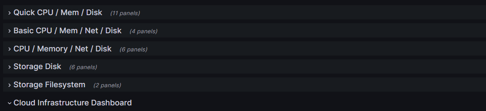

3\. Click on "three dots" at the upper right corner.

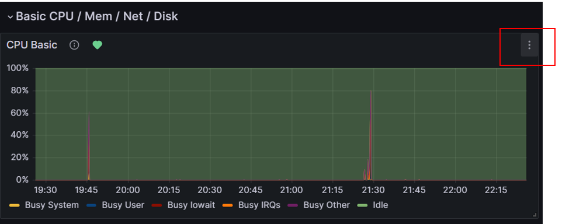

4\. Click on the "edit" button.


5\. Select " Alert".

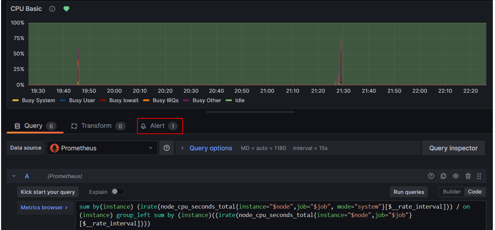

6\. Select " Create alert rule from this panel"

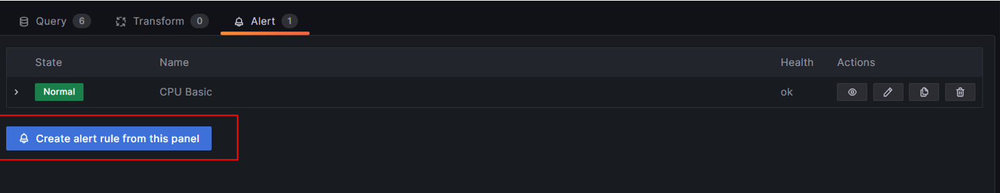

7\. Name the alert rules.


8\. Determine the query and alert condition.

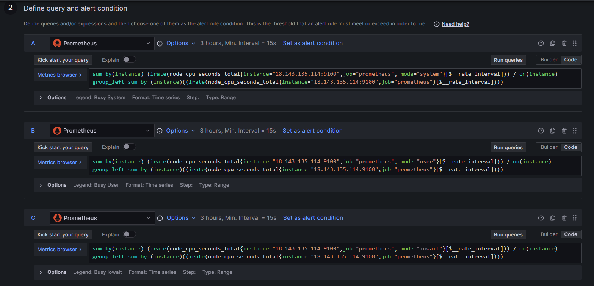

9\. Determine the alert expression and set it as alert condition.

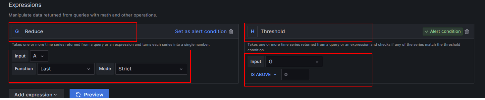

10\. Click on "Set as alert condition"
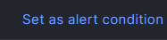, green words alert condition
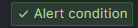 will appear.

11\. Set alert evaluation behaviour. Select "Folder"
(**Capstone-Project-Dashboard**) and "Evaluation
group"(**Capstone-Project-Dashboard**), followed by "pending
period"(**=5m**).

\*create new evaluation group by clicking " **+new evaluation group**
"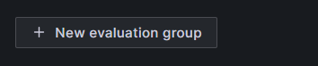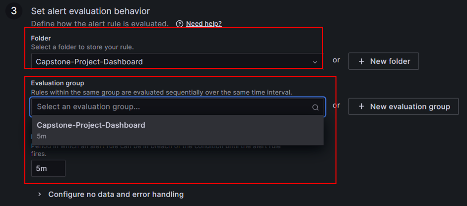

**[Step 3: Test the Alert]**

To ensure that your alerting and notification setup is working
correctly, you can test it:

under Configuration notifications

1\. Click the \"preview routing" to see the notification policy is
routed to the selected contact points.

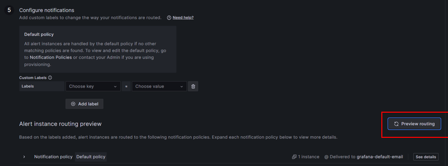

2\. Click on see details.

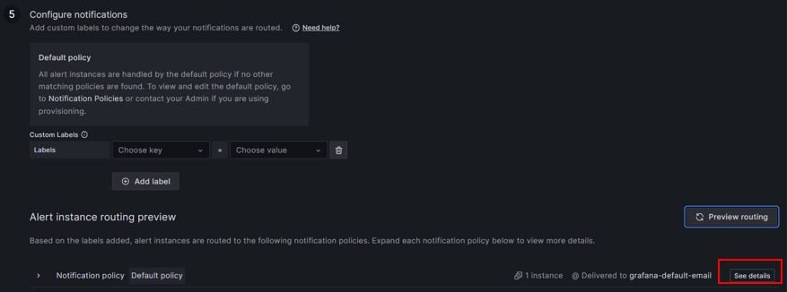

Routing details can be shown as below (example)

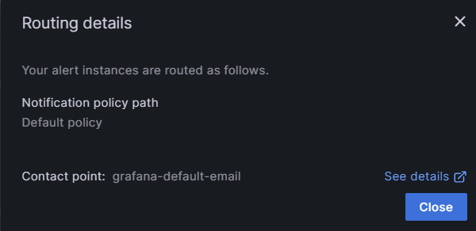

2\. Verify that you receive notifications through the configured
channels (e.g., email, Slack).

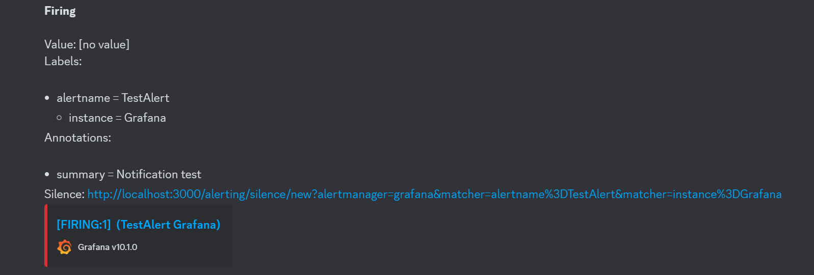

**[Step 4: Monitor and Adjust Alerts]**

After setting up alerts and notifications, monitor your Grafana
dashboard for alert triggers. When an alert condition is met, Grafana
will send notifications to the configured channels.

You can further adjust and fine-tune your alerts by modifying the alert
rules and conditions in Grafana\'s dashboard settings.

By following these steps, you can receive notifications in Grafana when
specific conditions are met, allowing you to proactively monitor and
respond to changes in your metrics and data.

**[Webhook URL generation using Discord]**

1.  Register a Discord account.

2.  Login the Discord account with the credential information.

3.  Click on "plus" button to add the server channel.

> 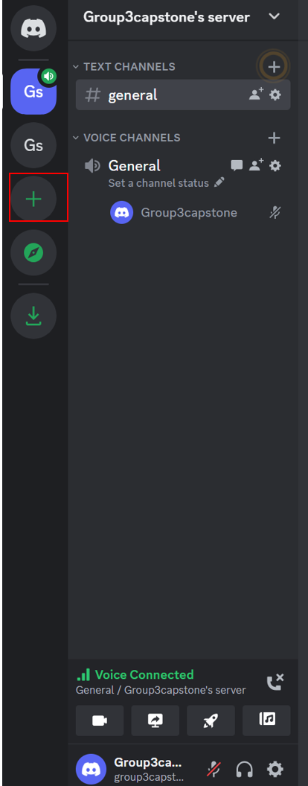

4.  Select "Create My Own".

> 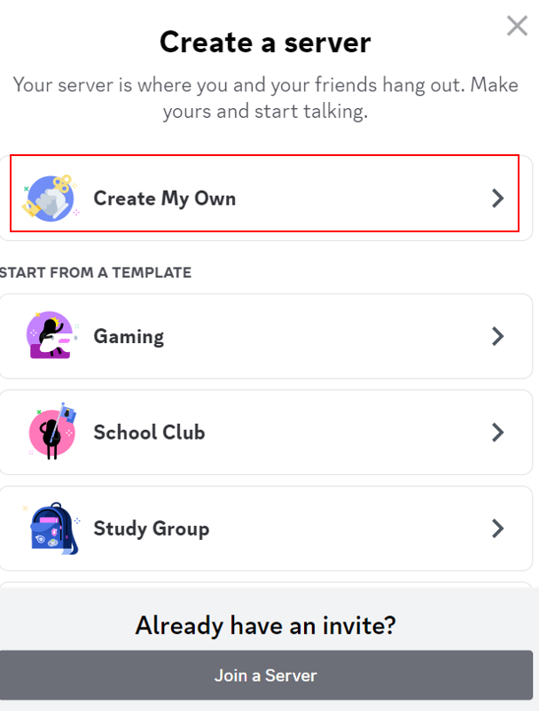

5.  Select " For me and my friends"

> 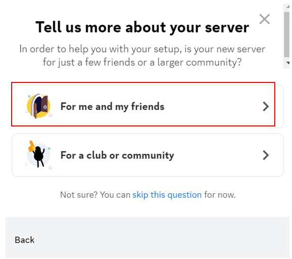

6.  Name the server.

> 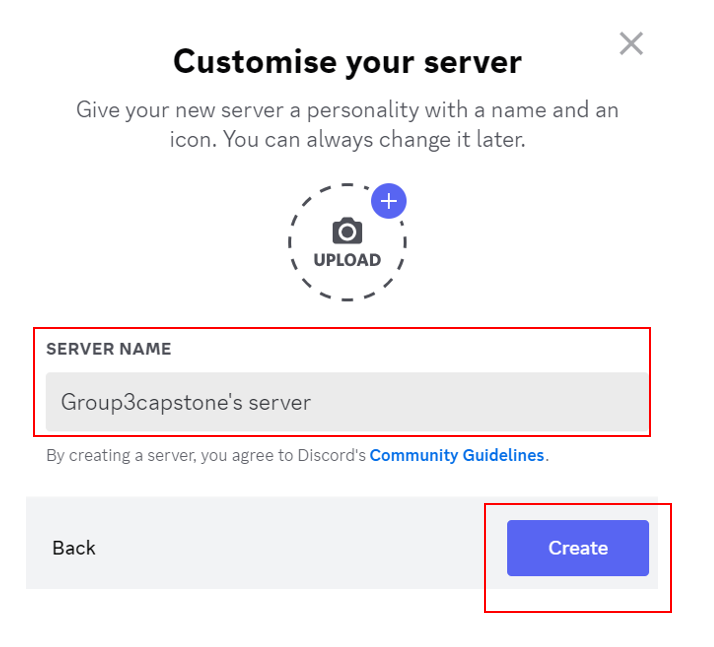

7.  Click on the "gear button" to go to the setting.

> 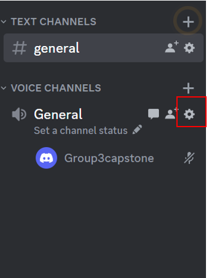

8.  Select "Integration" at the left panel.

> 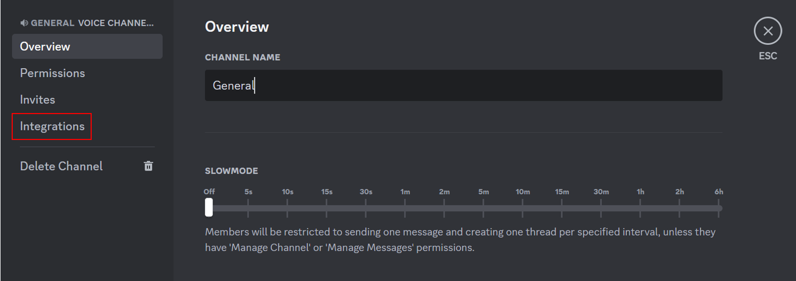

9.  Select "View Webhook" to extract the url.

> 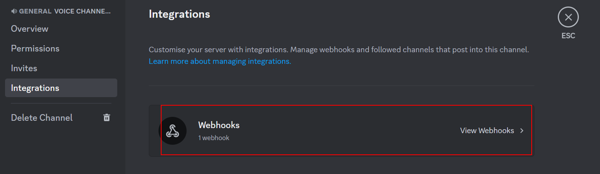

10. Click on the arrow to view the Bot details.

> 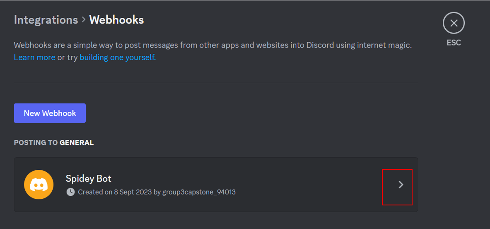

11. Copy the url into the contact point configuration.

> 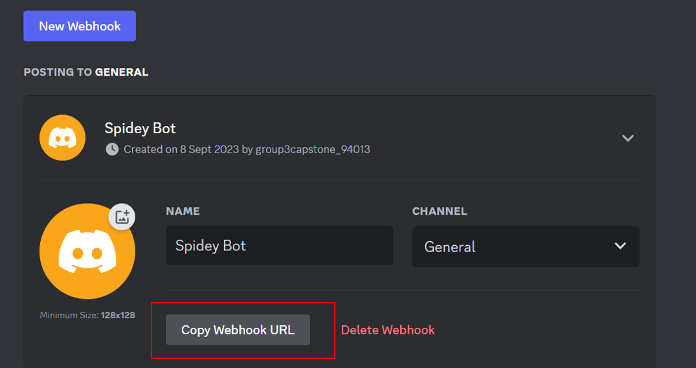
>
> 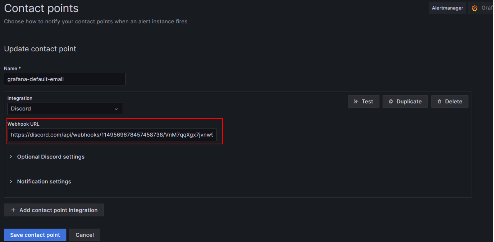
>
> **[Things to improve:]**

1.  Create Cloudwatch alerts from Grafana dashboard directly instead of
    using SES.

2.  Create better customised dashboards to monitor the application.

3.  Automate creation of incident tickets directly in Jira when alert is
    triggered.
